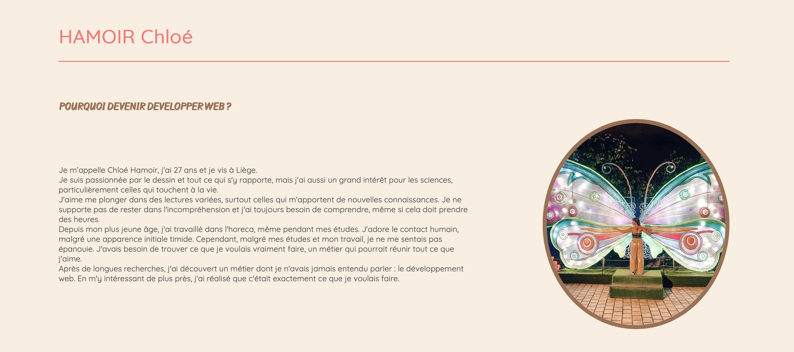
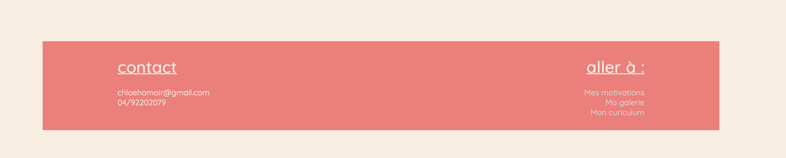
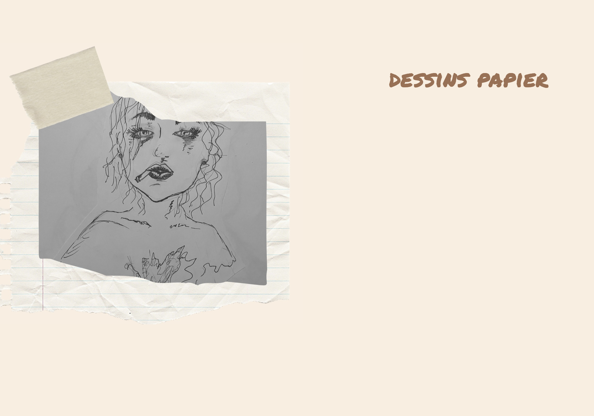

# Mon premier site web 

site sur mes motivations de devenir web developpeur pour le but de l'inscription à Becode. 
composé de 4 pages (presentation générales, motivations détaillé, galerie de dessins et CV )

## Color Reference

| Color             | Hex                                                                |
|--------------- | ------------------------------------------------------------------ |
|background |  #faeee0|
|header/footer/title|  #fa7878 |
|border/subtitle|  #9F6F51|


## Demo






## Tech Stack
front tech 
- html
- css


## Deployment

To deploy this project run

```bash
  npm run deploy
```


## Authors

- [Hamoir Chloé ](https://www.github.com/littlefoxy1nk)


